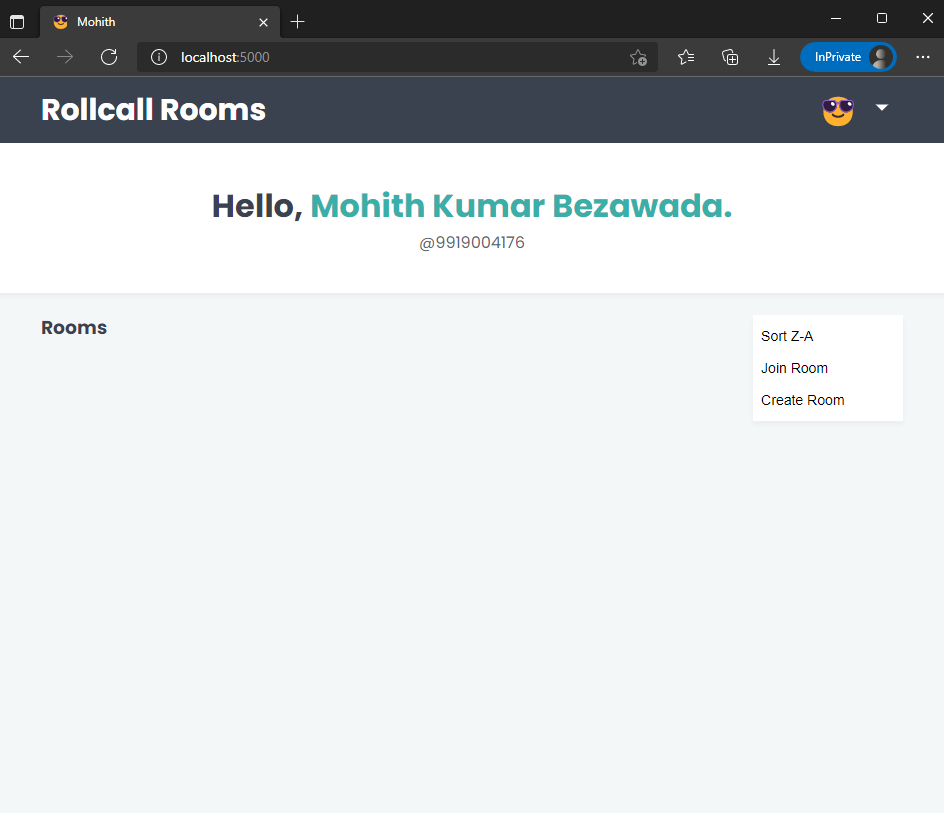

# 🖐️ ROLLCALL **ROOMS**

RollCall Rooms is easy way to take attendance with in less time. We generate a random QR CODE for every `15` or `n` seconds, users can scan to qr to record their presence in the room.

### Application Home Page Preview

https://rollcall-rooms.herokuapp.com



## About **Project**

I have build this web application with react as front-end and express as the backend.For the database i have used the Mongodb Atlas online database under _free tier (500mb max)._

### Working

- Well, Each class will have an admin who can control the room like editing room description,create rollcall session etc.
- An User can join the room using the room id provided by the admin\*. Now he/she can have the privilege to attend the rollcall session.
- An admin can now create rollcall session that closes in certain seconds and **qrcode** refresh interval.
- The User can now open the rollcall session and scan the qrcode.\*\* **Using the socket io the scan result will be immediately send to admin.**
- After closing of session, the session data is available nest 10 minutes. **Admin can download the result of the rollcall in form csv with absentees at first.**

> \* Admin can also block the room joinings.\
> \*\* We will be storing the ip address of the user in the cache which will ensure **_that same user couldn't scan from multiple accounts on same device._**

## Planning

I have attached the `Balsamiq Wireframes` file in `extras/wireframes`, which show the planning of the website._(I took some of the front-end design inspiration from HackerRank)_.

## Deploy Process

Added all the folders to this repo (_not the private one 😁_). Pushed the code to heroku and deployed. Sounds easy but there is a trick here.
You can see that i have different folders for client and server,but this approach doesn't seem to work with heroku 😖. **So i followed this,**

Created a **package.json** file in the root directory and written the following in it.

```json
{
    ...,
    "scripts": {
        "start": "npm start --prefix server",
        "install-client": "cd client && npm install && npm run build && cd ..",
        "install-server": "cd server && npm install && cd .. ",
        "heroku-postbuild": "npm run install-client && npm run install-server"
    }
}
```

`heroku-postbuild`* - Run's the command after installing the node_modules in root directory.This really worked for me 😁.

> *reference - https://www.codegrepper.com/code-examples/javascript/heroku+post+builds

